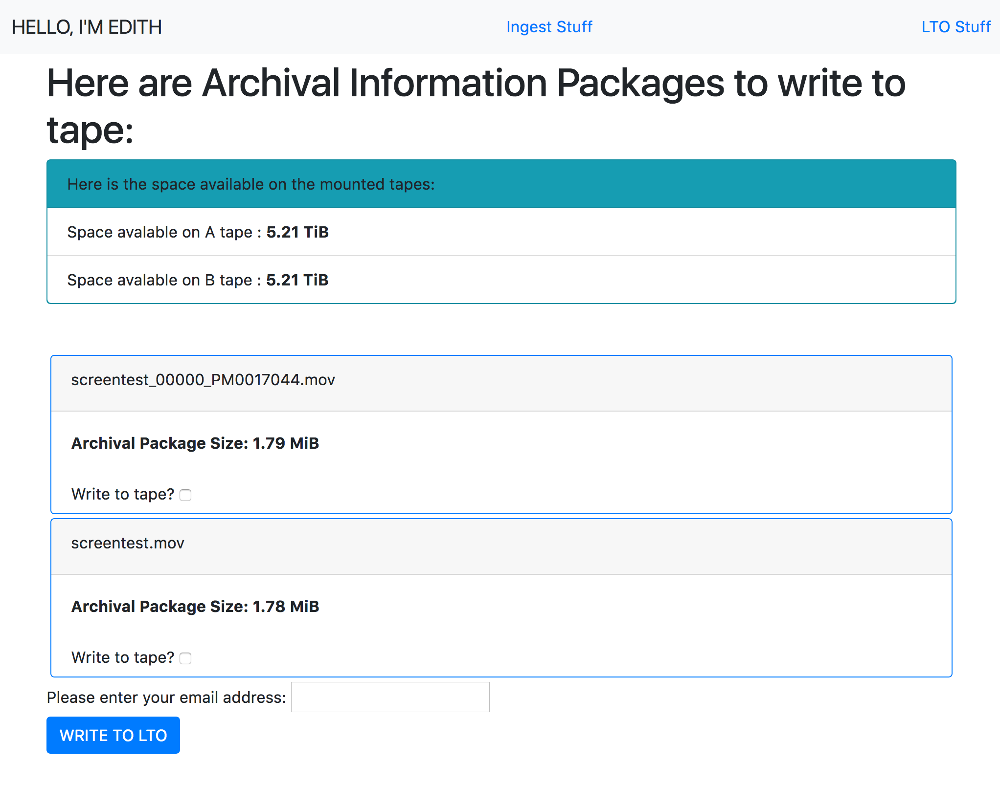

# EDITH
`EDITH` is a webapp for use in BAMPFA audiovisual digital preservation. It is both the core and the front end of our local digital repository. `EDITH` uses the Flask framework to:

1. provide archive staff with a few simple choices...

   * What asset(s) to ingest into our digital repository
   * What options to apply to the ingest process(es)
   * What additional descriptive metadata to add to each asset

2. ... then act on those choices using scripts that:
   * gather descriptive and technical metadata
   * generate fixity benchmarks (and perform checks during file movement)
   * transcode derivatives
   * package resulting A/V files and metadata into OAIS Submission Information Packages
   * and post access copies and metadata to ResourceSpace for internal digital asset management.

3. ... then write and read Information Packages to and from LTO.

## some high-level details
First, on ingesting an asset, we create a Submission Information Package [\(following the OAIS conceptual model\)](https://en.wikipedia.org/wiki/Open_Archival_Information_System) for audiovisual files using [pymediamicroservices](https://github.com/BAM-PFA/pymm) (`pymm`).

`pymm` is a python 3 port of some core functionality in [mediamicroservices](https://github.com/mediamicroservices/mm), namely the package structure, metadata extraction, etc. There's a lot inspired by the [Irish Film Archive](https://github.com/kieranjol/IFIscripts) and many other colleagues.

The pymm-generated SIP consists of a predefined folder structure containing the preservation master object, its derivatives, and technical metadata about each file, including checksums. `pymm` creates a derivative access copy that is appropriate for use in ResourceSpace and for research access. Objects being ingested may either be simple (a single A/V file) or complex (a folder containing subfolders with multiple reels of a DPX scan, for example).

`pymm` also uses the MySQL database structure used in `mm` to record [PREMIS](https://en.wikipedia.org/wiki/Preservation_Metadata:_Implementation_Strategies) events and file characteristics.

During the ingest process, we query one of the BAMPFA FileMaker databases used for collection management of our film and audio collections. This provides basic descriptive metadata and technical information about analog source material in cases where the original has been accessioned into the BAMPFA collection. This is returned as JSON that is also sent to ResourceSpace along with any access files created during ingest.

The SIPs can then be written to [Linear Tape Open (LTO)](https://en.wikipedia.org/wiki/Linear_Tape-Open). Each tape is also indexed in the `pymm` MySQL database. This portion uses code inspired by [`ltopers`](https://github.com/amiaopensource/ltopers).

Internally [ResourceSpace](https://resourcespace.com) hosts both access copies of assets and descriptive metadata drawn from our collection management systems, as well as user supplied metadata. It also includes the LTO tape id of assets written to tape so it's a handy front end for managing assets in the repository.

## Usage overview

* Users log in in order to access the system. Each user is defined as belonging to a specific BAMPFA department (which helps per-asset access rules), as well as having an individual ResourceSpace API key.
* A user selects files/folders to ingest.
* Enter any descriptive metadata that may apply.
* If the asset is described in a BAMPFA database, select the database to be queried.
* Searching the filename for either an accession number or a barcode, the FileMaker database is queried and metadata returned, or not, as the case may be.
* An access file is created and sent to RS along with descriptive metadata JSON.
* SIP (including master, derivatives, checksums, and metadata) is prepared and moved to a staging location, from where each package may be written to LTO.
* The LTO write process is done manually:
  * Mount the current A/B tape pair.
  * List the AIPs that are ready to be sent to tape.
  * Make your selection and hit GO.

Here's what the ingest and LTO menus look like now:




## Dependencies
Tested on Ubuntu 16.04.
* Runs on Python 3
* ~~paramiko (on Ubuntu `pip3 install -U paramiko` for correct Cryptography build)~~ [not currently being used, but still imported in some scripts]
* requests (`pip3 install requests`)
* `gcp`
* `pymm` dependencies:
   * mediainfo
   * ffmpeg
   * Levenshtein
   * mysql connector/python
   * lxml
* Flask-specific dependencies:
  * Flask (pip3 install Flask; gets core Flask dependencies automatically: wtforms, werkzeug)
  * flask_wtf (pip3 install flask_wtf)
  * flask-migrate (pip3 install flask-migrate)
  * flask-login (pip3 install flask-login)
  * SQLAlchemy (pip3 install flask-sqlalchemy)
  * flask-bootstrap (pip3 install flask-bootstrap)

## Setup overview

We are running Flask in production with Apache using the `mod_wsgi` module (see also the [Flask](#flask-ui-notes) section). Honestly, this sucks to set up.

[insert db setup and dev setup notes from 2/2019]

`pymm` requires some configuration of input and output paths, database configuration (only need to do this once at setup). There are a couple of non standard Python 3 libraries used and a couple of additional programs (see below for a list).

ResourceSpace has some setup requirements that are [documented](https://www.resourcespace.com/knowledge-base/systemadmin/install_macosx) on its website. Mostly just getting the Apache server settings correct and tweaking some of the PHP got it working.

Previous iterations of `EDITH` used ODBC to connect to our FileMaker 13 database, but due to some constraints (FM doesn't provide an ODBC driver for Linux) I am now using the FileMaker [XML API](https://web.archive.org/web/20170913213334/https://fmhelp.filemaker.com/docs/13/en/fms13_cwp_xml.pdf). It's... ok. We set up the FM Server to provide the XML Web Publishing API and our DBA created a FM view specifically for this purpose. Presumably if you (aka future me) want to reuse the ODBC code to perform more standard SQL queries on a less proprietary database, you can dig through the history to plug it back in.

Here's a cool RAID setup [tutorial](https://www.digitalocean.com/community/tutorials/how-to-create-raid-arrays-with-mdadm-on-ubuntu-16-04) for Ubuntu...

### Permissions & Config files
#### Flask and `pymm` configs
We use a Flask "instance" config file to record some details like passwords. There's a general config file for less specific/sensitive info. `pymm` requires you to set up a separate config file that records user passwords and database details. Each of these has an example config that you can base a working version from.

#### General system file permissions
`sudo chmod [-R] 777` is helpful on:

  * `pymm_log.txt` (the system log created by `pymm`)
  * `/path/to/EDITH/EDITH/app/tmp/` directory used to write and read temp files

Also, the Apache user needs write access to any files/folders being ingested. You can use `setfacl` to help, but files that are copied need but currently (8/2018) I'm searching for a better way for files to automatically get `777` permissions or for a secure way to script `chmod` without needing `sudo`/storing root password.

A viable option I'm looking into is for our network file share to be a "working" file repository where users can send new AV files. In that NAS, there can be a dir where files that are correctly named, DPX sequences correctly arranged, etc., can be placed. That dir can be watched by an `rsync` daemon configured here in `EDITH` that will suck in files to the `EDITH` intake directory (the `SHARED_DIRECTORY` in the config file). This allows me to run `rsync [...] --chmod=ugo+rw [...]` and get around having to set write permissions for Apache.

And unfortunately (at least on Linux) the Apache user needs to be added to the sudoers file to run `sudo ltfs` and `sudo umount` without a password. Do `sudo visudo` and add `www-data ALL=(ALL) NOPASSWD: /usr/local/bin/ltfs, NOPASSWD: /bin/umount`

## Some other details
We link to a handful of other systems in our ingest process:

### FileMaker
Files that are digitized/born digital works from the BAMPFA film collection include a portion of the original accession number in the filename. The script uses that number to query the film collection database and retrieve relevant descriptive metadata. We use '00000' to denote items that are not (yet) accessioned, so we can also search for a 9-digit barcode in a filename to query FM. If that fails, there is no uniqe ID to search in FM and we just set the descriptive metadata to null values.

[Here](https://fmhelp.filemaker.com/docs/13/en/fms13_cwp_xml.pdf) is the FileMaker 13 XML API documentation.... :(

### ResourceSpace
[ResourceSpace](https://www.resourcespace.com/) is an open-source digital asset management system that uses a PHP/MySQL web interface. It's very intuitive and responsive, and it allows for in-browser playback of videos using [VideoJS](http://videojs.com/). Metadata fields are totally customizable and accessible via the API.

The ResourceSpace API call post assets and metadata metadata at the same time.

#### RS Proxies
`pymm` uses `ffmpeg` to transcode the derivative access files. Pymm lets you specify default video and audio access levels. We set ours pretty high since we will use them for research screenings and such.

## LTO
This is based on [`ltopers`](https://github.com/amiaopensource/ltopers) to write the AIP created by `ingestfile` to LTO tape. We use an HP 2-drive unit that we use to create a redundant backup, with full tapes stored in separate locations.

A user can insert new tapes in the drives and format them via a call to `mkltfs` and there's a form for users to update the "Current LTO ID" that is recorded in a text file. The current ID is formmatted as YYMM#A where "#" is a sequence number 1-9 that starts over each month. If we go over 9 tapes for a month, the sequece restarts with A-Z. The `mkltfs` call does not allow users to reformat tapes that are already formatted with LTFS.

Currently, users have to mount the LTFS filesystem to the system each time that they need to write AIPs to tape. This is so that after a write, the tape filesystems can be unmounted and the index.schema XML file can be updated with new content listings. This schema file is then parsed

Upon ingest, AIPs are sent to a shared directory on the server that is then listed when a user wishes to write to tape.

Each AIP is written to LTO using the `pymm` function `move_n_verify_sip()` to verify the AIP completeness via `hashdeep`. If the the transfer to LTO is verified as successful there is an API call to ResourceSpace to add the LTO ID of the 'A' tape to the RS record for the ingested object. Ingested objects can then be searched by LTO tape ID and this provides a first-line index of LTO tape contents.

The user that Apache is run as (declared in ingestfiles.wsgi) has to be added to the `tape` user group so that it has access to the tape devices in Linux. I am not totally sure what this will/would look like in Mac. `ltopers` on Mac doesn't seem to need additional permissions.

On mounting a tape, there's also a temporary .json file that is created listing the tape letter (A/B), the mountpoint for the tape filesystem (in the `tmp` folder of the app), and the number of 1024-byte blocks that are available on the tape (read from a call to `df` during the mount process). This is read and displayed to users in human-readable format when AIPs are listed (along with the total size of each AIP).

## Flask UI notes:
The structure of the app is pretty basic. I have some of the 'secret stuff' and all the configurable paths set up in an 'instance-specific' `config.py` file. There should be at least one Admin user who can use the interfaces for setting up Departments, Metadata Sources, Metadata Fields, other Users, and so on.

Setting up `mod_wsgi` really sucks. You *have* to make sure to build it with the same install of Python being used in the system. This would probably be easier with a virtual environment but at the moment I'm running directly on the system default python3. Also, make sure the nonstandard python modules required are installed system wide and not to a specific user (again, probably less of an issue with a venv...).

### Flask DB setup
* Create an empty mysql database called `edith` and a user with admin privileges:
  * `GRANT ALL PRIVILEGES ON edith.* TO 'user'@'localhost' IDENTIFIED BY 'password';`
* Add these user details to the *instance* config SQLALCHEMY_DATABASE_URI variable (see the exmple_config.py)
* run
```
flask db init
flask db migrate
flask db upgrade
```
* Run `flask shell` from within the edith project root directory (`cd /path/to/edith`) and make an admin user for the app:
```
>>> from app.models import User
>>> from app import db
>>> admin = User(email="admin@example.com",username="admin",password="admin2016",is_admin=True)
>>> db.session.add(admin)
>>> db.session.commit()
```

You may need to run `export FLASK_APP=/path/to/edith.py` and `export FLASK_CONFIG=development` in order to use the Flask shell.

## Some major unknowns/ to-dos
* Searching the `pymm` database. This could probably be built into the Flask app but... yeah. I think we will mirror the `pymm` db on our FileMaker server instance since it's already in use.
* Alert for an LTO tape that is getting full
  * CURRENTLY (5/22/18) THE TOTAL SIZE OF AIPS TO WRITE ARE TOTALLED. THIS TOTAL NUMBER OF BYTES SHOULD BE COMPARED TO THE NUMBER OF BYTES AVAILABLE ON THE TAPE AND ANY WRITES PREVENTED IF THERE'S INSUFFICIENT ROOM.
* Explore a plugin to re-query Filemaker if the database record has changed
